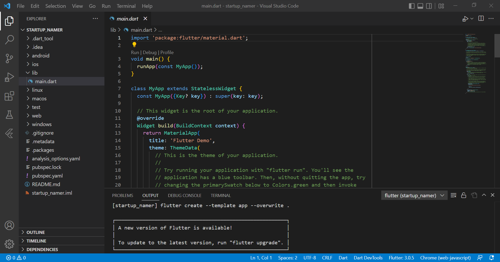
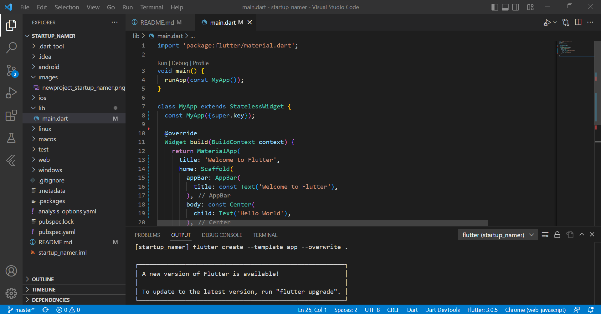
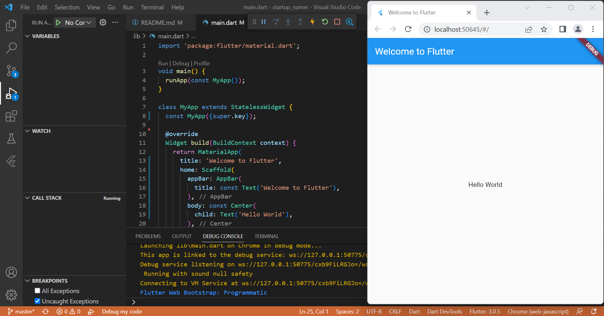
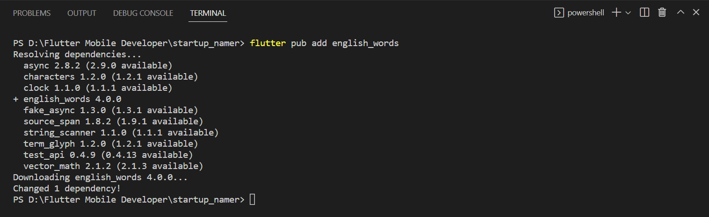
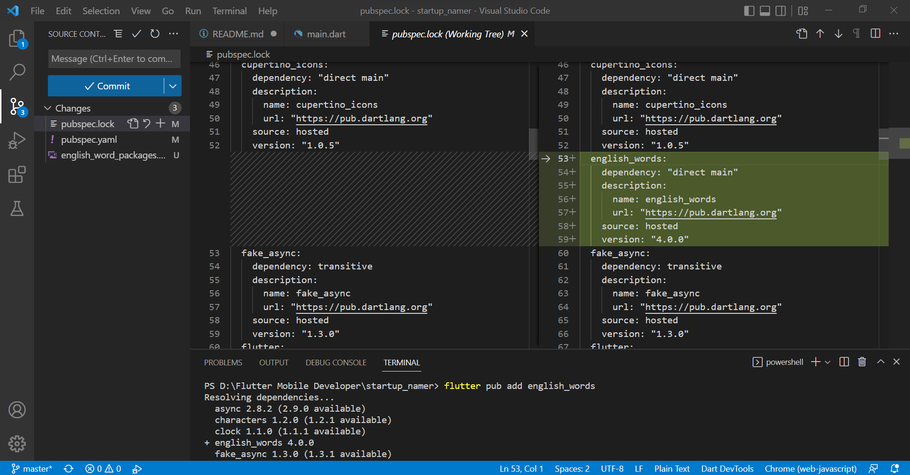
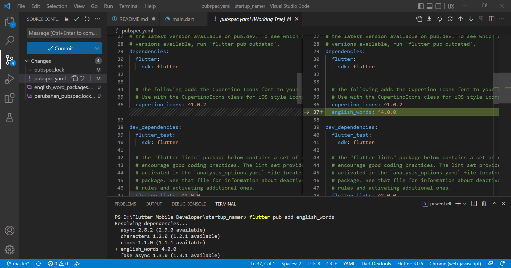
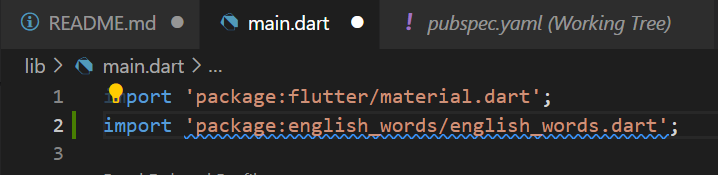
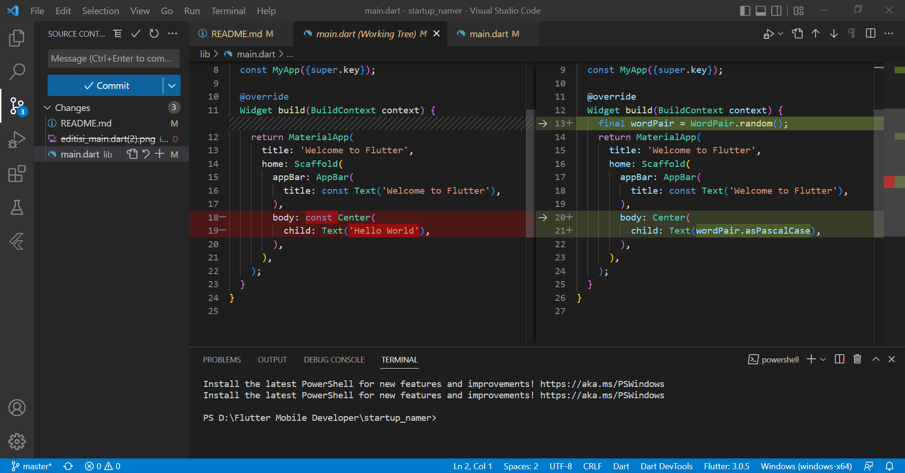

# Laporan Praktikum

## 1. Membuat Aplikasi Flutter Pemula
- Pembuatan project baru bernama **startup_namer** di vscode

- Mengedit isi _lib/main.dart_

- Menjalankan aplikasi

## 2. Menggunakan _External Package_
- Penambahan _package_ **english_words** sebagai **dependency** aplikasi

> Pada saat _package_ **english_words** ditambahkan ke _project_, file **pubspec.lock** dan **pubspec.yaml juga berubah, seperti pada gambar diatas**.

- Import _package_ baru ke file **main.dart**

- Perubahan pada file **main.dart**

