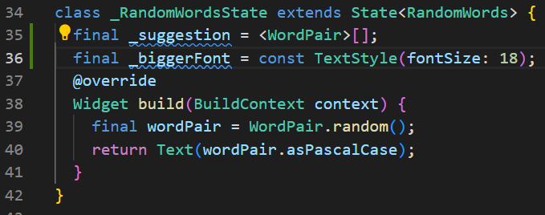
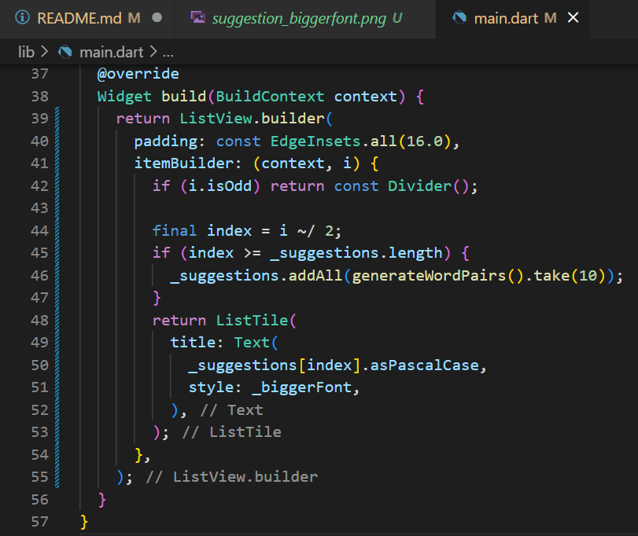
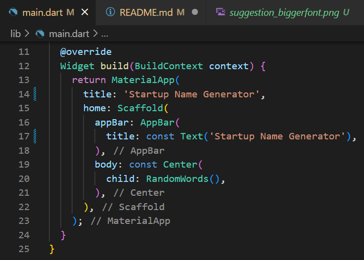
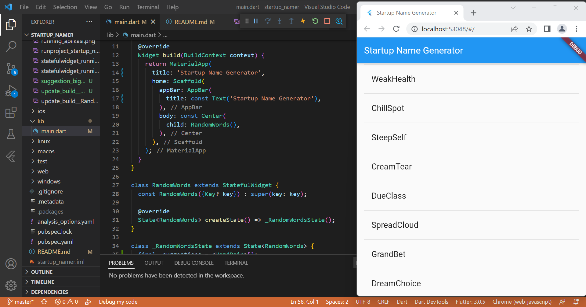

# Laporan Praktikum

## 1. Membuat Aplikasi Flutter Pemula
- Pembuatan project baru bernama **startup_namer** di vscode

- Mengedit isi _lib/main.dart_

- Menjalankan aplikasi

## 2. Menggunakan _External Package_
- Penambahan _package_ **english_words** sebagai **dependency** aplikasi

> Pada saat _package_ **english_words** ditambahkan ke _project_, file **pubspec.lock** dan **pubspec.yaml juga berubah, seperti pada gambar diatas**.

- Import _package_ baru ke file **main.dart**

- Perubahan pada file **main.dart**

- *Running* aplikasi

> Ketika aplikasi di jalankan, aplikasi akan menampilkan tulisan dari package **english_words**. Kemudian tiap kali aplikasi dijalankan ulang / _hot reload_, tulisan akan selalu berubah. Hal ini terjadi karena pasangan kata dihasilkan di dalam metode **build**, yang berjalan setiap kali **MaterialApp** memerlukan _rendering_, atau saat mengaktifkan _Platform_ di _Flutter Inspector_.

## 3. Menambahkan _Stateful Widget_
- Membuat kode _boilerplate_ untuk _stateful widget_

> Ketika **stful** diketikkan pada baris baru file **main.dart**, maka akan muncul popup untuk memmbuat _stateful widget_.

- Menamakan widget sebagai **RandomWords**

> Ketika salah satu tulisan **MyWidget** diganti dengan tulisan **RandomWords**, maka semua kata **MyWidget** akan berubah secara otomatis menjadi **MyWidget**.

- Memperbarui metode **build()** pada **_RandomWordsState**

- Menghilangkan _word-generation_ dari **MyApp**

- _Hot reload_ aplikasi

## 4. Membuat _Infinite Scrolling ListView_

- Menambahkan _state variable_ ke kelas **_RandomWordsState**

> Menambahkan sebuah daftar **_suggestion** untuk menyimpan gabungan kata yang disarankan. Juga, menambahkan variabel **_biggerFont** untuk membuat *font* lebih besar. 

- Memperbarui metode **build** pada **_RandomWordsState**

- Memperbarui metode **build** pada **MyApp**

- _Running final app_

